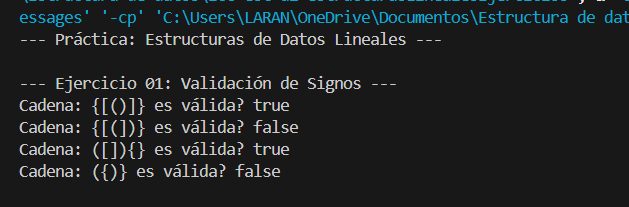
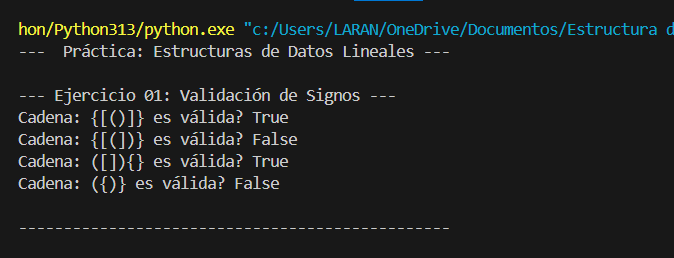
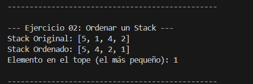
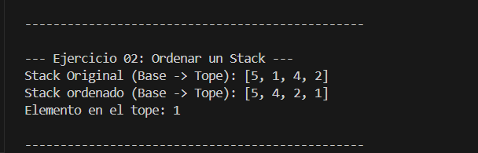
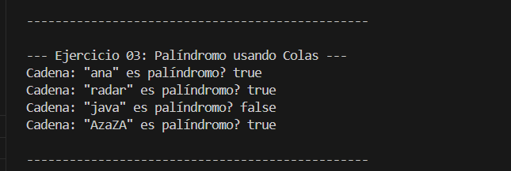
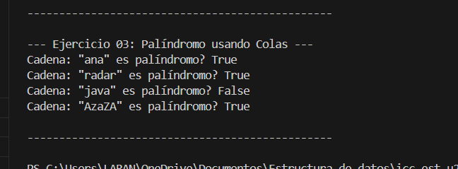

# Estructura de Datos

### Nombre: Juliana Torres

# Práctica: Estructuras de Datos Lineales (Stack y Queue)

Esta práctica implementa tres algoritmos utilizando estructuras de datos lineales (Pilas y Colas) en Java y Python, respetando la modularidad y las restricciones de cada ejercicio.

## Ejercicio 01: Validación de Signos

### Descripción del Problema
Verificar si una secuencia de signos de apertura (, [, { y de cierre ), ], } está correctamente balanceada y anidada.

### Descripción de la Solución

Se utiliza una Pila (Stack), aprovechando su propiedad LIFO (Last-In, First-Out).

1. Iteración: Se recorre la cadena carácter por carácter.

2. Apertura: Si el carácter es un signo de apertura, se introduce en la pila (push).

3. Cierre: Si es un signo de cierre:

    - Se verifica que la pila no esté vacía (debe haber una apertura previa).

    - Se saca el último signo de apertura de la pila (pop).

    - Se comprueba que el signo de cierre actual coincida con el signo de apertura que acaba de salir (e.g., } debe corresponder a {). Si no coinciden, la cadena es inválida.

Resultado: La cadena es válida si, y solo si, la pila queda vacía al finalizar el recorrido (todas las aperturas fueron cerradas).

### Salida Esperada en Java

### Salida esperada en Python

## Ejercicio 02: Ordenar un Stack

### Descripción del Problema

Ordenar una Pila de números enteros de forma que los elementos más pequeños queden en el tope de la pila. Restricción: Solo se permite usar una Pila auxiliar.

### Descripción de la Solución

Se utiliza un algoritmo de ordenamiento por inserción adaptado a dos pilas (mainStack y auxStack).

1. Se extraen elementos de la mainStack uno por uno.

2. Para cada elemento extraído (currentElement):

    - Se comparan currentElement con el tope de auxStack.

    - Mientras el tope de auxStack sea mayor que currentElement, se mueven los elementos de auxStack de vuelta a mainStack. Esto crea un espacio en auxStack para que currentElement se inserte en su posición ordenada.

    - Finalmente, se inserta currentElement en auxStack.

3. Al finalizar el proceso, auxStack contiene los elementos ordenados (el más pequeño en su base y el más grande en su tope).

4. Se transfieren todos los elementos de auxStack a mainStack. Dado que el tope de auxStack es el mayor, al insertarse en mainStack, el elemento más pequeño original termina en el tope de mainStack.

### Salida Esperada en Java

### Salida esperada en Python

## Ejercicio 03: Palíndromo usando Colas

### Descripción del Problema

Verificar si un String es un palíndromo (se lee igual al derecho y al revés) utilizando dos estructuras de Cola (Queue), sin comparar el string directamente.

### Descripción de la Solución

Se utiliza la propiedad FIFO (First-In, First-Out) de las colas junto con una Pila auxiliar para lograr la inversión de la secuencia.

1. Cola Original: Se inserta la cadena en una cola (originalQueue) en orden normal (FIFO).

2. Inversión: La cadena se inserta primero en una Pila auxiliar (LIFO).

3. Cola Invertida: Los elementos se extraen de la Pila auxiliar (LIFO) y se insertan en una segunda cola (invertedQueue) (FIFO). Esto garantiza que invertedQueue tenga la secuencia de caracteres al revés.

4. Comparación: Se extraen elementos de ambas colas simultáneamente (poll() o popleft()).

5. Resultado: Si todos los elementos coinciden hasta que ambas colas quedan vacías, la cadena es un palíndromo (true). Si en algún momento difieren, es false.

### Salida Esperada en Java

### Salida esperada en Python

